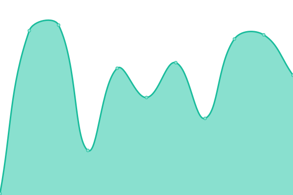

# 

Upptime (https://upptime.js.org) is the open-source uptime monitor and status page, powered entirely by GitHub Actions and Issues.

## [📈 Status](https://upptime.js.org)

_This section is updated automatically when the status of any site changes._

<!--start: status pages-->

| URL | Status | History | Response Time | Uptime |
| --- | ------ | ------- | ------------- | ------ |
| [QAInsights](https://qainsights.com) | 🟩 Up | [qa-insights.yml](https://github.com/qainsights/UpTime/commits/master/history/qa-insights.yml) |  516ms | 

<!--end: status pages-->
